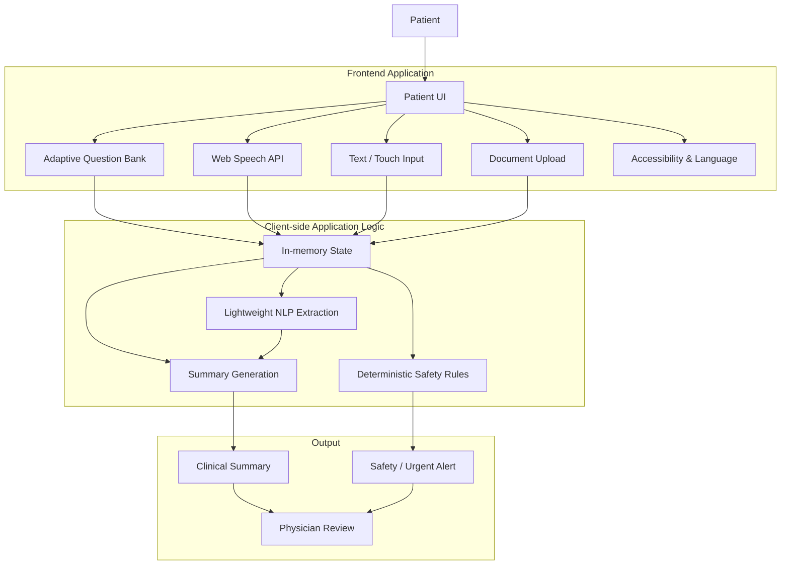
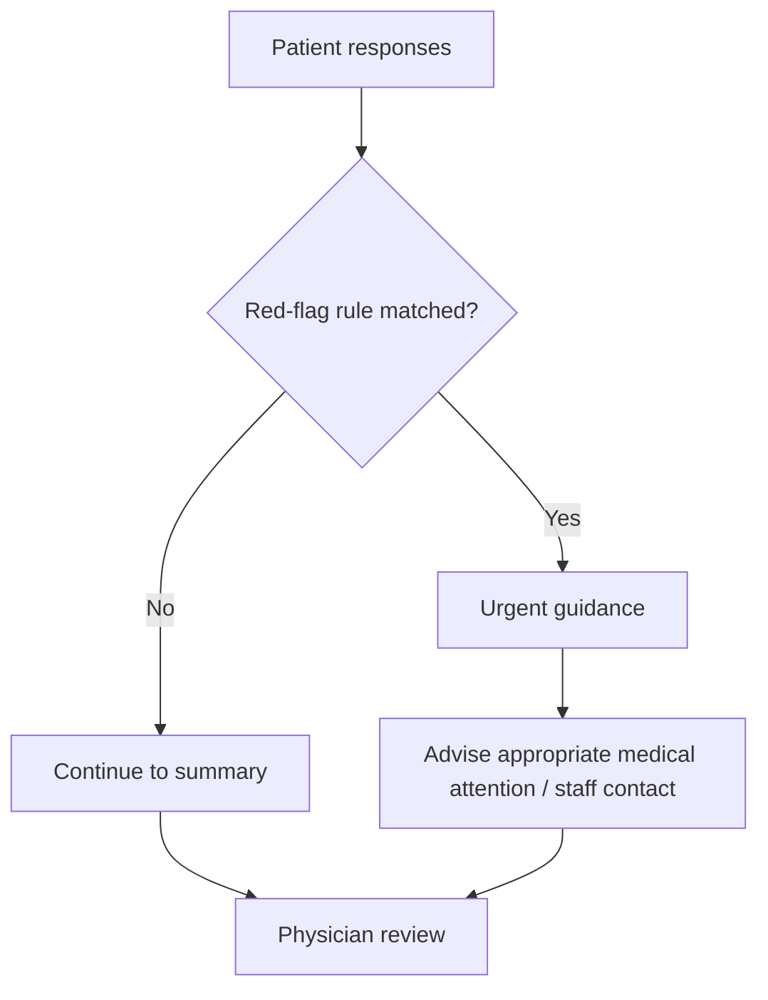
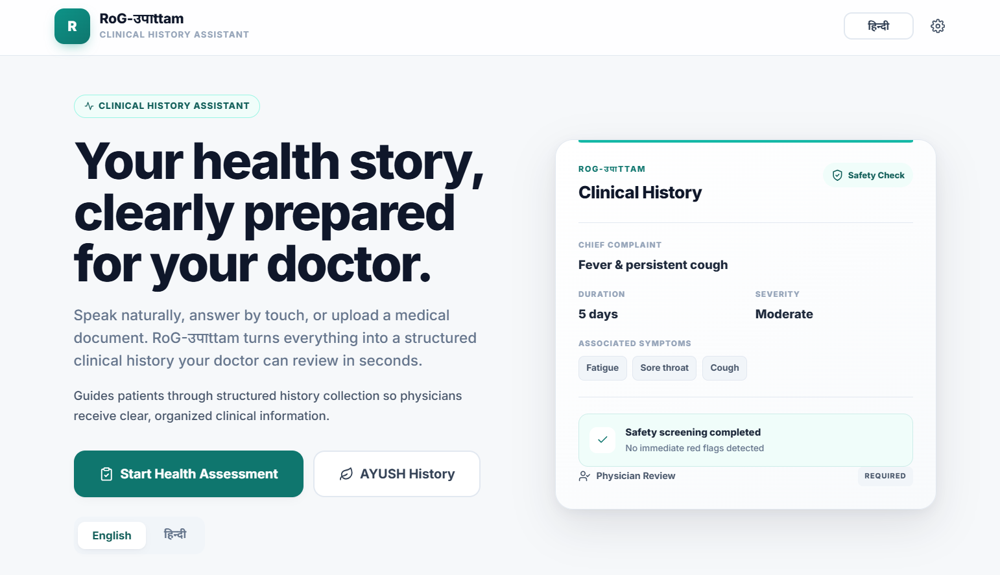
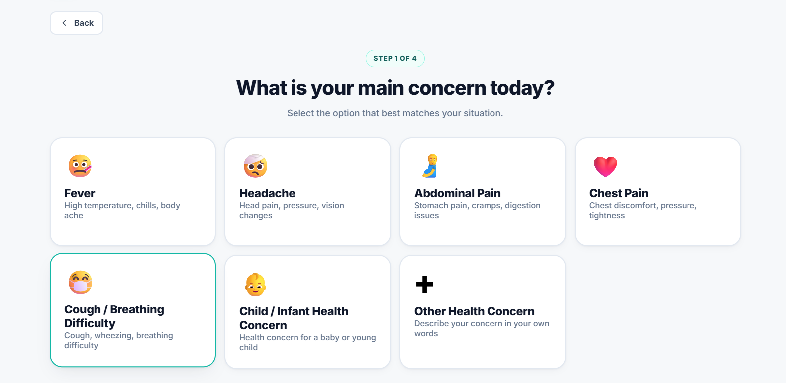
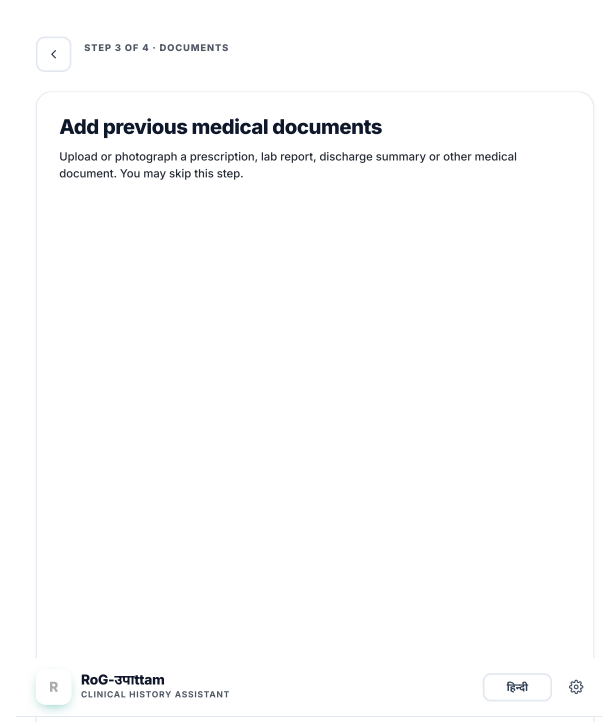
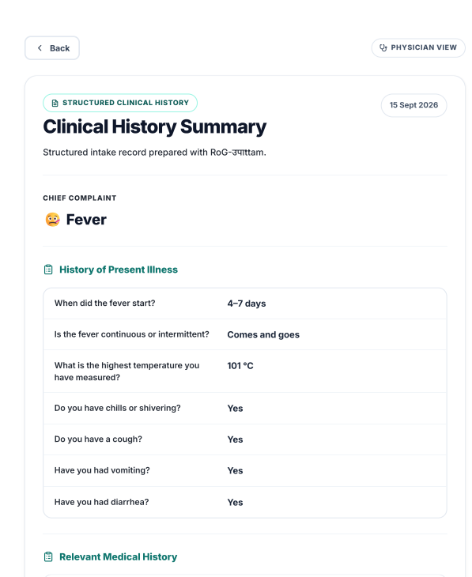
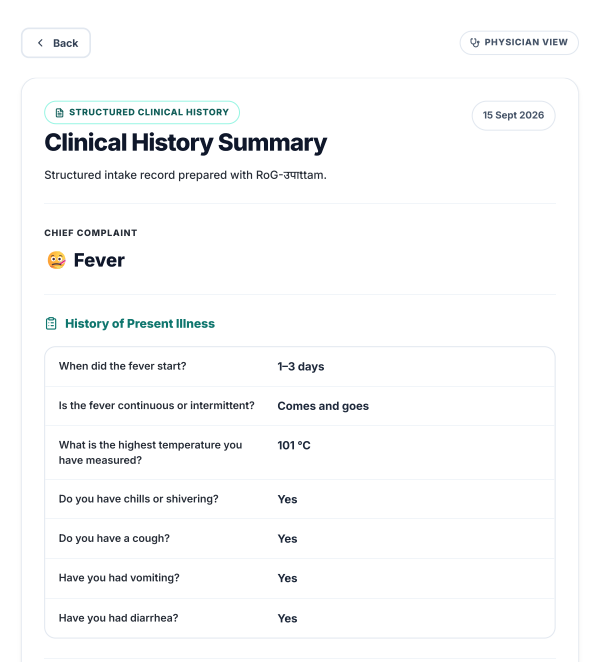

# RoG-उपाttam — Clinical History Assistant

<p align="center">
  <strong>A patient-friendly clinical history assistant for structured pre-consultation health information.</strong>
</p>

<p align="center">
  <a href="https://github.com/Dharmesh-eng15/SIH-2026-Project">
    
  </a>
  
  
  
  
</p>

<p align="center">
  
  
  
  
</p>

---

## Overview

**RoG-उपाttam** is a healthcare workflow prototype designed to help patients communicate their medical history more clearly before a doctor consultation.

Instead of relying on a patient to remember and verbally explain every detail during a short consultation, the prototype guides the patient through **concern-specific questions**, supports **voice, text and touch input**, accepts **previous medical documents**, performs a transparent **safety/red-flag screening**, and prepares a **structured clinical summary for physician review**.

The goal is not to replace a clinician. The goal is to improve the quality and structure of patient-reported information before clinical decision-making.

> **Safety note:** RoG-उपाttam is a history-assistance prototype, not a diagnostic system. Final diagnosis and treatment decisions remain with qualified healthcare professionals.

---

## Why this project?

A consultation can become inefficient when important history is incomplete, unstructured, difficult to remember, or difficult to communicate.

This prototype explores a simple workflow:

```text
Patient input
     ↓
Guided history collection
     ↓
Voice / Text / Touch
     ↓
Structured patient information
     ↓
Safety screening
     ↓
Clinical summary
     ↓
Physician verification
```

This turns an unstructured conversation into information that can be reviewed more consistently.

---

## Key Features

| Feature | What it does |
|---|---|
| 🩺 Concern-based assessment | Starts with the patient's main health concern and loads a relevant question flow |
| 🎙️ Voice input | Uses the browser Web Speech API for spoken responses |
| ⌨️ Text input | Supports typed free-text answers when voice is unavailable |
| 👆 Touch-first interface | Uses large controls intended for simple patient interaction |
| 🌐 English + Hindi | Provides bilingual interface/content support |
| ♿ Accessibility controls | Includes large text, high contrast and touch-only options |
| 📄 Medical document upload | Lets users attach JPG/PNG/PDF medical documents to the assessment |
| 🛡️ Safety screening | Applies deterministic red-flag rules and can surface urgent guidance |
| 🧠 Lightweight NLP extraction | Extracts supported symptoms, severity and approximate duration from free text |
| 📋 Structured clinical summary | Organizes collected history into a physician-readable summary |
| 👨‍⚕️ Physician review | Provides a dedicated review/verification stage |
| 🪷 AYUSH history | Includes an additional traditional-medicine history flow |
| 🔗 Interoperability-ready design | Documents planned ABHA/ABDM, HIS/EMR and FHIR-based integration paths |

---

## User Journey

```text
01  Patient opens the application
        ↓
02  Consent + patient details
        ↓
03  Select the main health concern
        ↓
04  Answer guided questions
        ├── Voice
        ├── Text
        └── Touch / MCQ
        ↓
05  Add previous medical documents
        ↓
06  Run safety / red-flag screening
        ↓
07  Generate structured clinical summary
        ↓
08  Physician reviews and verifies
```

---

## System Architecture

### Current prototype



### Important implementation detail

The current repository is intentionally a **frontend prototype**:

- No production backend is connected.
- Application state is held in JavaScript memory.
- Document handling is demonstrated client-side.
- The current NLP layer is rule/keyword based, not a trained clinical ML model.
- Safety screening is deterministic and transparent.
- OCR, cloud storage, authentication, hospital HIS/EMR connectivity and clinical interoperability are planned production components.

This distinction is important when evaluating the repository: the code demonstrates the **patient-facing workflow and interaction design**, while the roadmap shows how the prototype can evolve into a production system.

---

## Clinical Safety Flow

The application does not try to make an autonomous diagnosis.

Instead, supported high-risk combinations can trigger an urgent guidance screen:



The rules are implemented in JavaScript so that their behavior is deterministic and inspectable.

---

## Lightweight NLP Layer

Free-text answers can be analyzed by the client-side NLP helper.

For supported terms, the implementation can extract:

```text
Raw patient text
      ↓
Normalization
      ↓
Symptom detection
      ↓
Severity detection
      ↓
Approximate duration detection
      ↓
Local symptom relationships
      ↓
Structured result
```

Example concept:

```text
"I have severe stomach pain and vomiting since yesterday"

            ↓

Symptoms  → abdominal pain, vomiting
Severity  → severe
Duration  → 1–3 days
Category  → abdominal
```

This is a **prototype extraction layer** based on predefined terms and rules. It is not intended to replace clinical NLP validation or a medical language model.

---

## Technology Stack

| Layer | Current implementation |
|---|---|
| Structure | HTML5 |
| Styling | CSS3 |
| Application logic | Vanilla JavaScript |
| Voice | Web Speech API (`SpeechRecognition`) |
| File handling | Browser `FileReader` API |
| Language | English + Hindi |
| State management | In-memory JavaScript object |
| Deployment model | Static frontend / GitHub Pages compatible |

### Planned production stack

```text
Frontend
  React / Next.js
        ↓
Backend
  Python + FastAPI
        ↓
Clinical processing services
  ASR • OCR • NLP • AI-assisted summarization
        ↓
Secure data layer
  Database • document storage • audit logs
        ↓
Hospital integration
  HIS / EMR • ABDM • FHIR-based interoperability
```

---

## Accessibility & Patient Experience

The interface is designed around patient usability rather than developer-oriented forms.

Current accessibility-oriented controls include:

- Large text mode
- High-contrast mode
- Touch-only mode
- Voice-assisted questions
- Large answer controls
- English/Hindi language switching
- Text fallback when microphone input is unavailable

The intent is to reduce the amount of reading, typing, and navigation required from a patient.

---

## Screenshots

### Home

<p align="center">
  
</p>

The landing screen introduces the assistant and communicates the core purpose before assessment begins.

### Health Assessment

<p align="center">
  
</p>

The patient starts with a concern and moves into a targeted history flow.

### Medical Document Upload

<p align="center">
  
</p>

The workflow provides a place for previous prescriptions, reports and other medical documents.

### Clinical Summary

<p align="center">
  
</p>

Collected information is organized into a structured summary for clinical review.

### Physician Review

<p align="center">
  
</p>

The final stage is physician-facing verification rather than autonomous medical decision-making.

---

## Repository Structure

```text
SIH-2026/
│
├── index.html
├── script.js
├── style.css
├── README.md
│
├── docs/
│   ├── ARCHITECTURE.md
│   └── DEMO_GUIDE.md
│
└── assets/
    └── screenshots/
        ├── home.png
        ├── assessment.png
        ├── document-upload.png
        ├── clinical-summary.png
        └── physician-review.png
```

---

## Run Locally

This is a static HTML/CSS/JavaScript application.

### 1. Clone

```bash
git clone https://github.com/Dharmesh-eng15/SIH-2026-Project.git
cd SIH-2026-Project
```

### 2. Start a local server

A local server is recommended for testing microphone permissions.

```bash
python -m http.server 8000
```

Then open:

```text
http://localhost:8000
```

### 3. Alternative

You can also open `index.html` directly for the non-microphone parts of the prototype.

### Browser note

Voice functionality depends on browser support for the Web Speech API. Chrome and Edge are the primary browsers to test for this feature. Text, touch, accessibility and document-upload flows do not depend on microphone support.

---

## Demo Walkthrough

For a quick presentation:

```text
Home
 ↓
Start Health Assessment
 ↓
Select concern
 ↓
Answer guided questions
 ↓
Demonstrate voice/text/touch input
 ↓
Add a sample document
 ↓
Show safety-screening behavior
 ↓
Open Clinical Summary
 ↓
Switch to Physician Review
```

A detailed demo script is available in [`docs/DEMO_GUIDE.md`](./docs/DEMO_GUIDE.md).

---

## Current Scope vs Production Roadmap

| Area | Current prototype | Production direction |
|---|---|---|
| UI | ✅ Implemented | Refine with hospital workflows |
| Bilingual interaction | ✅ Implemented | Expand language coverage |
| Voice input | ✅ Browser-based | Hospital-grade ASR service |
| Question engine | ✅ Client-side | Configurable clinical question service |
| NLP extraction | ✅ Rule-based prototype | Validated clinical NLP |
| Safety rules | ✅ Deterministic prototype | Clinician-reviewed rule engine |
| Document upload | ✅ Client-side flow | Secure document service |
| OCR | 🔄 Planned | OCR/document extraction pipeline |
| Backend API | 🔄 Planned | FastAPI / secure service layer |
| Database | 🔄 Planned | Secure relational + document storage |
| Authentication | 🔄 Planned | Patient/clinician identity and access controls |
| Physician dashboard | 🟡 Prototype review flow | Full clinical dashboard |
| ABHA / ABDM | 🔄 Planned | Standards-compliant integration |
| HIS / EMR | 🔄 Planned | Hospital-specific adapters |
| FHIR interoperability | 🔄 Planned | Production FHIR implementation |
| Deployment | ✅ Static demo | Secure hospital deployment |

---

## Design Principles

### 1. Patient first
Minimize friction and make the interaction easy to understand.

### 2. Structured, not overwhelming
Collect information progressively rather than asking for a large form at once.

### 3. Safety before automation
Potentially urgent patterns should surface clear guidance instead of being hidden behind an AI prediction.

### 4. Physician in the loop
The output is designed for clinician verification and use, not autonomous diagnosis.

### 5. Transparent prototype boundaries
Current capabilities are documented separately from future production architecture.

---

## Future Work

The next major engineering steps are:

```text
Frontend prototype
      ↓
Secure backend APIs
      ↓
Authentication + patient identity
      ↓
Encrypted data/document storage
      ↓
OCR + clinical NLP
      ↓
AI-assisted summarization
      ↓
Physician dashboard
      ↓
HIS / EMR integration
      ↓
ABDM / FHIR interoperability
      ↓
Hospital deployment + monitoring
```

---

## Live Demo

<p align="center">
  <a href="https://github.com/Dharmesh-eng15/SIH-2026-Project">
    <strong>🚀 Explore RoG-उपाttam Repository</strong>
  </a>
</p>

---

## Project Context

This project was developed as a **Smart India Hackathon 2026** software prototype.

### Project Concept

**Project concept and direction:** Dharmeshwar Dayal

The repository presents the current SIH 2026 prototype and its technical documentation. Earlier prototype implementation work was used as a foundation for the current repository, while the project concept, direction and final presentation are maintained here.

> Problem Statement ID, official problem statement title, team name and other submission metadata can be added here once finalized.

---

## Disclaimer

RoG-उपाttam is a software prototype for structured clinical-history assistance.

It does **not** provide a medical diagnosis and should not be treated as a substitute for professional medical care.

---

## License

No open-source license has been selected for this repository yet.

---

<p align="center">
  Built with HTML • CSS • JavaScript<br>
  <strong>Smart India Hackathon 2026</strong>
</p>
